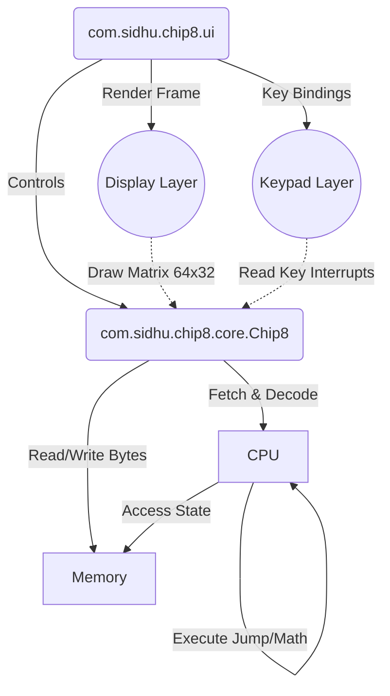

# CHIP-8 Emulator


A fully functional, low-level emulator for the CHIP-8 interpreted programming language. This project faithfully re-creates the CHIP-8 virtual machine in modern Java, allowing it to run classic 8-bit games and programs flawlessly. 

This emulator was built as a deep dive into CPU design, memory mapping, instruction decoding, and fixed-timestep execution cycles.

## Key Features

*   **Robust Architecture:** Object-Oriented design separating Core emulation logic (CPU, Memory) from the Presentation layer (Swing UI, Input).
*   **Accurate CPU Cycle Emulation:** Full Opcode set implementation supporting complex state management, subroutines, and binary-coded decimals (BCD).
*   **Fixed-Timestep Game Loop:** A high-performance 60Hz delta-time calculation loop ensures smooth timer execution while simulating a highly accurate ~600Hz synthetic CPU tick rate.
*   **Test-Driven Fundamentals:** Comprehensive unit tests covering Core arithmetic, CPU state updates, memory bounds, and opcode parsing.
*   **Trace Logging:** Configurable SLF4J/Logback tracing to debug runtime register states and view opcode dispatching.
*   **Modern Build Pipeline:** Integrated with Maven and automated GitHub Actions CI/CD workflows.

## System Architecture



## Technology Stack

*   **Language:** Java 17
*   **Build System:** Apache Maven
*   **Testing:** JUnit 5, AssertJ
*   **Logging:** SLF4J, Logback Classic
*   **UI Framework:** Java Swing

## Getting Started

### Prerequisites
*   [Java 17](https://adoptium.net/) or higher.
*   [Apache Maven](https://maven.apache.org/) (usually included in modern IDEs like IntelliJ or Eclipse).

### Quick Build & Run

1.  **Clone the Repository:**
    ```bash
    git clone https://github.com/sidhu1215/chip-8.git
    cd chip-8
    ```

2.  **Run the Test Suite:**
    Ensure compiling is successful and core logic works flawlessly.
    ```bash
    mvn clean test
    ```

3.  **Launch the Emulator:**
    ```bash
    mvn exec:java -Dexec.mainClass="com.sidhu.chip8.ui.GameWindow"
    ```
    *If no file argument is passed, a GUI File Chooser will open automatically!*

### Running via Command Line Argument
You can bypass the file picker by directly pointing to a `.ch8` ROM file:
```bash
mvn exec:java -Dexec.mainClass="com.sidhu.chip8.ui.GameWindow" -Dexec.args="path/to/pong.ch8"
```

## Keypad Mapping

The original CHIP-8 hardware utilized a 16-key hexadecimal keypad (0-F). This emulator natively binds it to a standard QWERTY keyboard schema:

| CHIP-8 Keypad | Mapped To | 
| :---: | :---: |
| `1` `2` `3` `C` | `1` `2` `3` `4` |
| `4` `5` `6` `D` | `Q` `W` `E` `R` |
| `7` `8` `9` `E` | `A` `S` `D` `F` |
| `A` `0` `B` `F` | `Z` `X` `C` `V` |
